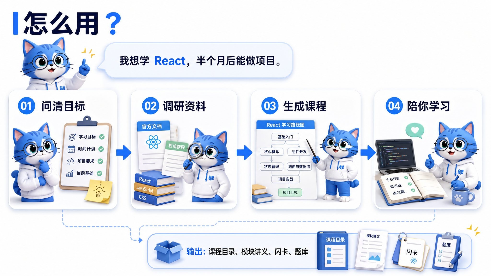
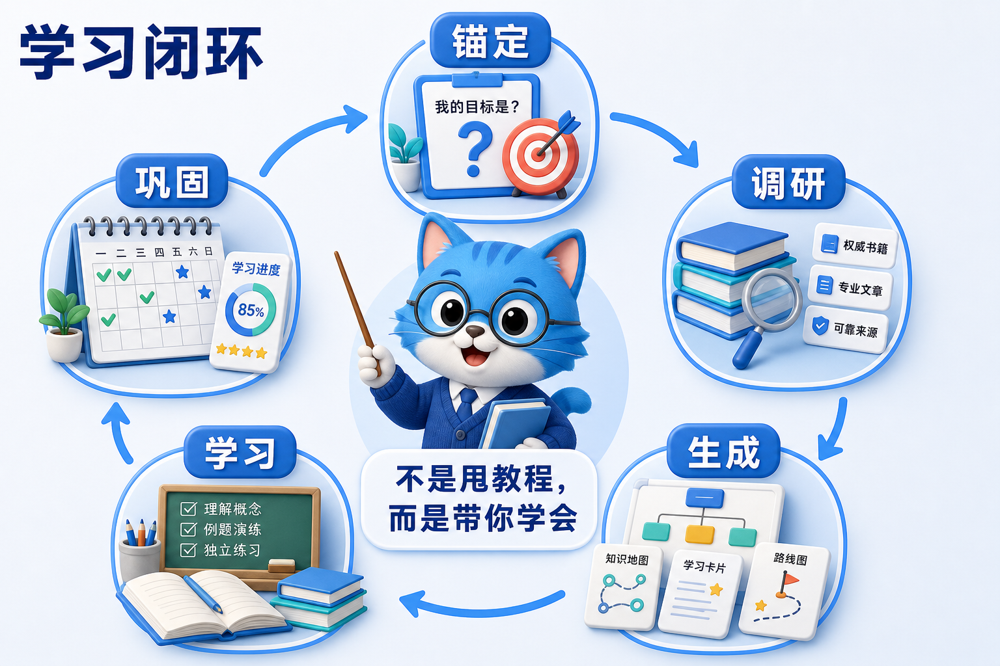

<div align="center">

# 学习.skill


<h3>请个师傅，学门真手艺。</h3>

**把一句“我想学”，变成一门能学完、能练会、能接着走的课。**

</div>

---

## 它能做什么

很多 AI 教程的问题不是“不够长”，而是**没问清你要去哪，也没查清资料靠不靠谱**。

本项目是一个 Agent Skill（给 AI 助手安装的能力包），做的是一条完整学习链路：

| 阶段 | 做什么 | 产出 |
| --- | --- | --- |
| **① 锚定目标** | 先问清学习范围、当前基础、时间安排和材料约束 | 学习路线图预览 |
| **② 调研资料** | 查官方文档、源码、权威教材、优质中文教程等可靠来源 | 调研摘要与课程结构 |
| **③ 生成课程** | 先生成课程概览，再按确认的大纲写模块讲义 | 课程目录、讲义、术语表、资源索引 |
| **④ 陪你学习** | 本地播放器看课件，智能体负责讲解、答疑和判断掌握度 | 每次学习会话和掌握度记录 |
| **⑤ 巩固复习** | 用间隔重复安排复习，回来时能接上进度 | 复习排期、学习快报 |

它不是只给你一份教程，而是让智能体先做功课，再像师傅一样带着你学。

## 怎么用

<div align="center">

</div>

通过一行命令快速安装：

```bash
npx skills add SugarMGP/study.skill
```

装好后，直接把想学的东西告诉智能体：

```text
我想学 React，半个月后能做一个小项目。
帮我从零开始学 Rust。
我想学 PostgreSQL 索引，重点是底层原理和面试。
下周考试，帮我按这份考纲复习数据库。
```

如果目标很大，比如“我想学 AI”，它会先给你画领域地图，帮你选方向；如果目标很具体，比如“学 React useState”，它会走更轻量的快速教学。

如果你有考纲、教材、课件、历年题，直接发给它。考试和课程类学习会优先按材料来，避免学一堆不考的内容。

> [!TIP]
> 学习时，智能体会优先启动本地课程播放器。播放器用来可视化展示 Markdown、Mermaid 图、图片、代码块和可保存练习；若本地课程播放器不可用，则智能体会直接在对话里输出课程内容。

## 学习模式

| 模式 | 适合谁 | 特点 |
| --- | --- | --- |
| **速成导览** | 临时换技术栈、先要能干活 | 精简解释，抓住最常用路径 |
| **系统精讲** | 想从原理到实践完整掌握 | 原理、对比、误区、练习都会展开 |
| **面试冲刺** | 准备技术面或项目追问 | 高频考点、手写题、追问和评分标准 |
| **考试备考** | 学校考试、考研考证、课程复习 | 对齐考纲，只学真正会考的内容 |

## 工作原理

<div align="center">

</div>

本项目的主线很朴素：

```text
锚定 → 调研 → 生成 → 学习 → 巩固
```

这里的几个词说人话就是：

- **锚定**：先弄清你到底想学到什么程度，不靠 AI 猜。
- **调研**：写课程前先看可靠资料，比如官方文档、源码、教材、优质中文教程。
- **生成**：把资料整理成能学的课程，而不是堆链接。
- **学习**：通过提问、讲解、练习和纠错，让你真的能做出来。
- **巩固**：记录进度和薄弱点，到了该复习的时候提醒你。

底层参考了 ADDIE 教学设计（先分析再设计课程）、Backward Design 逆向设计（先定学习结果再安排内容）、Gagné 九段教学法（学习过程的九个关键动作）、Bloom 认知目标分类（理解、应用、分析等层级）和间隔重复（按遗忘规律安排复习）。这些理论不会直接压到你脸上，只会变成更顺的学习体验。

## 产出文件

一次学习会在你的学习目录下留下可继续维护的文件：

```text
你的学习目录/
├── .learning-profile/
│   ├── profile.json             # 全局偏好和学习者画像：每日时长、提醒偏好、已会/薄弱前置
│   ├── scripts/                 # 运行期工具：复习检查、复习记录、安全写入
│   ├── tmp/viewer-sessions/     # 本地播放器保存的临时学习记录
│   └── courses/
│       └── {课程名}/
│           ├── meta.json        # 课程元数据：模式、当前模块、完成模块
│           ├── params.json      # 自适应参数：深度、速度、复习频率
│           ├── concepts.json    # 知识点状态：每个概念的 D/S 和复习历史，R 实时计算
│           └── domain-tree.json # 技能树与轻量游戏化进度
├── courses/
│   └── {课程名}/
│       ├── README.md            # 课程概览
│       ├── syllabus.md          # 完整大纲
│       ├── 01-xxx/content.md    # 模块讲义
│       ├── flashcards.csv       # 闪卡，可导入 Anki 等工具
│       ├── interview-qa.md      # 面试模式下的题库
│       ├── exam-practice.md     # 考试模式下的练习题
│       ├── glossary.md          # 术语表
│       └── resources.md         # 资源索引
```

`Anki` 是常见的记忆卡片工具；`flashcards.csv` 就是可以导入这类工具的表格格式。

## 仓库结构

```text
study.skill/
├── SKILL.md                         # skill 主流程，AI 助手会先读这个
├── README.md                        # 项目介绍
├── assets/                          # README 文档资源
├── references/
│   ├── phase-0-anchoring.md         # 锚定目标：问清学习需求
│   ├── phase-1-research.md          # 调研方法：找可靠资料
│   ├── phase-2-generation.md        # 课程生成：大纲和模块内容
│   ├── phase-3-learning.md          # 互动教学：讲解、练习、纠错
│   ├── phase-4-consolidation.md     # 巩固复习：进度和复习安排
│   ├── chinese-tutorial-guide.md    # 中文教程写作规范
│   ├── fsrs-scheduler.md            # 简化间隔复习算法
│   ├── learning-viewer.md           # 本地课程播放器使用规则
│   ├── migration-guide.md           # 旧学习状态迁移说明
│   ├── state-schema.md              # 学习状态文件结构
│   ├── skill-tree.md                # 技能树和领域地图
│   └── automation/                  # 各平台自动化提醒配置参考
├── viewer/
│   ├── server.py                    # 本地课程播放器服务
│   └── viewer.html                  # 本地课程播放器页面
└── scripts/
    ├── init-profile.sh              # macOS / Linux 初始化脚本
    ├── init-profile.ps1             # Windows 初始化脚本
    ├── check-reviews.py             # 复习到期检查脚本
    ├── record-review.py             # 复习评分记录脚本
    ├── migrate-profile.py           # 旧数据迁移脚本
    └── write-state.py               # 安全写入 JSON 状态文件
```
