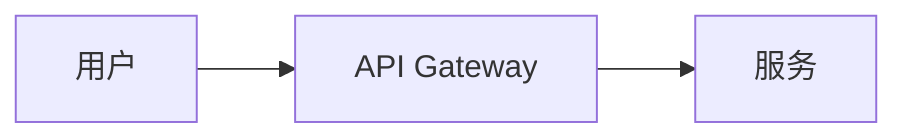
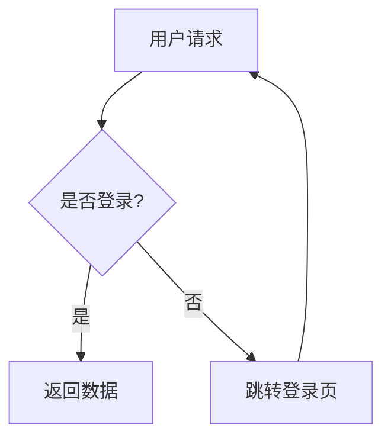

# 中文教程写作规范

> 综合：ai-agents-from-zero, rust-course, 极客时间, 廖雪峰, 阮一峰,
> CS-Notes, JavaGuide 的共性写作模式

## 三层递进结构

**技术主题：**
```
第一层：基础入门（30%）→ 建立概念，跑通第一个程序
第二层：核心能力（40%）→ 深度讲解，动手实践
第三层：进阶实战（30%）→ 原理深挖，面试备战
```

**非技术主题：**
```
第一层：基础入门（30%）→ 建立概念框架，理解核心问题
第二层：深层理解（40%）→ 关键理论、案例、推导
第三层：批判拓展（30%）→ 不同学派、前沿讨论、自选专题
```

## 单章写作模板

每章必须包含以下结构（参考 ai-agents-from-zero）：

```markdown
# 第X章：{标题}

---
**本章课程目标：**
- [ ] {Bloom's Apply/Analyze level objective}
- [ ] {Bloom's Apply/Analyze level objective}
- [ ] {Bloom's Analyze/Evaluate level objective}

**学习建议：** {1段话，告诉读者抓什么重点}

**官方文档与资源：** → [工具导航索引]
---

## X.1 {节标题}

> 本节目标：{一句话}

### X.1.1 {知识点}

正文：大白话解释 → 术语对照 → 例子/推导/代码 → 练习/运行结果 → 关键要点引用块
→ 对比表格（vs 相似概念）→ 判读标准（什么时候用/不用/适用场景）

### X.1.2 {知识点}

{同样模式}

## X.2 {节标题}

{渐进深入}

---

**📝 本章思考题**
1. {问题}
   **参考思路：** {怎么想，不只是答案}
2. {问题}
   **参考思路：** ...

**📋 本章小结**
- {概念要点，5-8 条}
- {关键判断/决策要点}
- {常见陷阱提醒}

**➡ 建议下一步**
{技术主题：先跑通本章代码 → 进入第 X 章}
{非技术主题：先完成本章练习/思考题 → 进入第 X 章}

**🎯 相关面试题**（面试导向模式下必含）
1. {面试题}
   **回答要点：** {key points}
```

## 图表规范

当模块需要图表时按以下规范。是否需要图表由 `phase-2-generation.md` 的 Quality Gate 按模块层级和内容复杂度决定，不强制每模块都有图。需要时按以下优先级：

### 优先级 1 · 现成优质图（优先复用）

调研阶段（Phase 1）同步收集官方文档、教程中的现成图表。满足以下条件则直接使用：
- 清晰可读，无模糊/破损
- 内容与当前教学点直接相关
- 无版权问题（官方文档截图、CC 协议图片、公开架构图均可）

嵌入：`` 或引用 URL。标明来源：`*图片来源：{source_url}*`

### 优先级 2 · 平台生图（复杂场景）

若没有合适的现成图，且图表满足以下任一条件，使用平台的图像生成能力：
- 内容精细复杂，Mermaid 无法表达（如 UI 界面示意、数据结构可视化、物理/生物图示、详细的思维导图）
- 需要真实感的示意（如系统部署拓扑、性能火焰图风格示意）
- 流程中节点 >15 个，Mermaid 自动布局难以阅读

生成 PNG/SVG，嵌入 ``。图片下方保留 Mermaid 源码（折叠块）方便修改：

````markdown

<details><summary>📐 Mermaid 源码（可编辑）</summary>

</details>
````

**若平台无生图能力，直接走优先级 3。**

### 优先级 3 · Mermaid（通用兜底）

所有平台可用。嵌入为 ` ```mermaid ` 代码块。主流 Markdown 预览器原生渲染。

### 按场景选图表类型

| 场景 | 图表类型 | Mermaid 语法 |
|------|---------|-------------|
| 概念之间的关系 | 流程图 | `flowchart TD` |
| 系统架构/组件关系 | 横向流程图 | `flowchart LR` |
| 步骤/时序交互 | 时序图 | `sequenceDiagram` |
| 数据对比/分类 | Markdown 表格 | `\| A \| B \|` |
| 层级/包含关系 | 缩进列表 + ASCII 框线 | bullet list |

### 图表规则

- 一张图一个要点，不要塞太多信息
- 节点文字用中文，变量/函数名保留原文
- 每张图配一行说明文字：`*上图展示了...*`
- 技术主题优先用架构图和流程图，非技术主题优先用关系图和层级图
- Mermaid 代码块即可，不需额外 PNG（主流 Markdown 预览器原生支持 Mermaid）

### 示例



## 写作风格规范

### 1. 口语化解释 + 术语准确

先用日常语言建立直觉，再给出精确术语。

✅ "可以把 Hook 理解成一个钩子——它钩住 React 的状态管理，让函数组件也能'记住'数据。这个钩子的学名叫 useState。"
❌ "useState 是 React 的一个 Hook API，用于在函数组件中管理状态。"

### 2. 类比必含

每个核心概念至少一个贴切类比。优先级：日常生活 > 已知技术 > 抽象概念。

### 3. "先记住一句话" 模式

每个核心概念开头给一句口诀式总结：
> **先记住一句话：** 「XXX 就是 YYY」

### 4. 判读标准明确

不只说"是什么"，必须阐明：
- ✅ 什么时候用 XXX？
- ❌ 什么时候不用 XXX？
- 🤔 XXX vs YYY 怎么选？

用对比表格呈现。

### 5. 示例/练习规范

**技术主题 — 代码示例：**
- 所有代码必须可运行
- 使用中文注释（不是英文注释的翻译）
- 展示运行结果
- 标注 `【案例源码】` 链接

**非技术主题 — 案例/推导/练习：**
- 每个概念配一个具体案例
- 推导过程逐步展示（不跳步）
- 练习形式：辨析题、论述题、应用场景分析
- 标注 `【参考来源】`

### 6. 否定式澄清

主动消除常见误解：
- "不是'越多越好'，关键是..."
- "不是所有场景都需要...，只有当...时才用"
- "这和 XXX 不一样——区别在于..."

### 7. 版本说明（仅在变化影响学习时）

技术主题：API、语法、工具链、依赖有破坏性变化时才写版本说明，不要无关版本也标注。
非技术主题：引用教材版次、论文年份、数据时间即可，不硬写版本章节。

### 8. 踩坑指南

每章至少 2 条常见陷阱：

| 问题表象 | 原因 | 解决方案 |
|----------|------|---------|
| ... | ... | ... |

### 9. 面试题链接

面试导向模式下，每章关联 2-3 道典型面试题，含回答要点。

## 禁止事项

- ❌ 英文直接机翻 —— 用中文思维重新组织
- ❌ 堆砌术语不解释
- ❌ 只给代码不给运行结果
- ❌ 只讲是什么不讲为什么和怎么选
- ❌ 忽略影响学习结果的版本变化
- ❌ 大段照搬官方文档（引用链接即可）
- ❌ AI 写作痕迹 —— 避免夸大的象征意义、三段式法则、空洞连接词、宣传性语言
