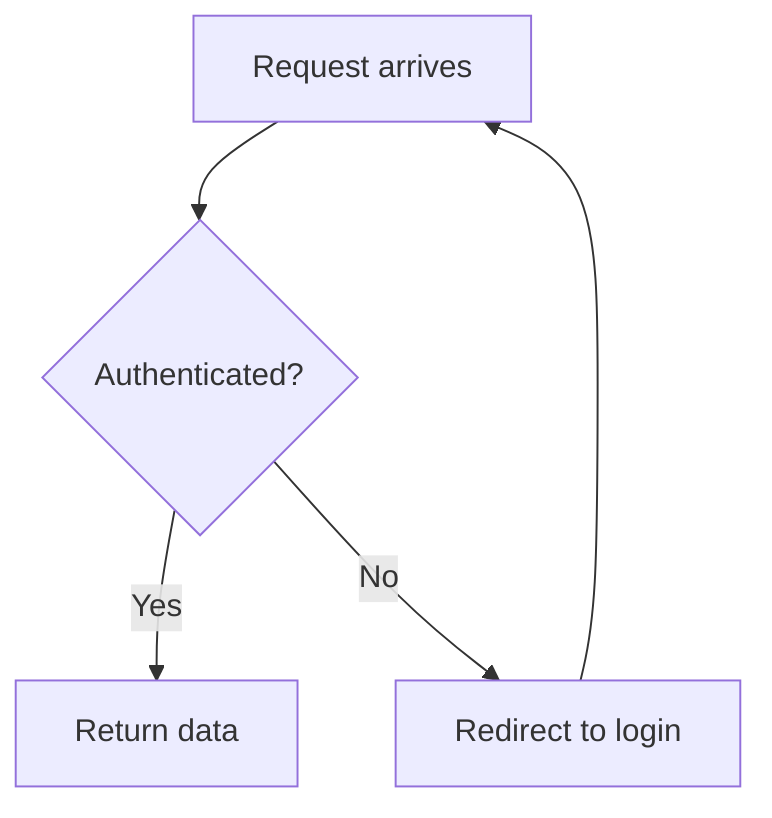
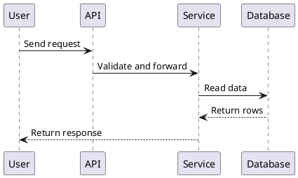
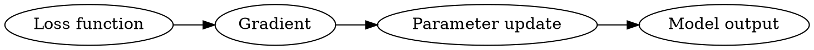

# 课件通用格式规范

本文件是跨语言课件格式的主真相源，适用于中文、英文和双语课程。

它规定课程文件结构、共享教学完整性规则、图表、图片、代码示例和可保存练习块；不规定某种语言的表达风格。中文表达看 `chinese-tutorial-guide.md`，英文表达看 `english-tutorial-guide.md`。播放器启动、会话文件和运行时写入规则看 `learning-viewer.md`。

## 文件与小节结构

- 课程文件面向学习者，不写内部设计说明、生成理由、字段解释或工具选型。
- 每个模块围绕一个主目标展开；模块根目录的 `content.md` 写章节前言，小节正文写入 `{module}/{section}/content.md`。
- 模块前言不能只是小节目录。它要用短篇幅交代：本模块承接前面什么、解决什么主问题、为什么按这些小节顺序学、学完能做什么判断或任务。前言仍然保持导航性质，不展开替代小节正文。
- 一个小节只讲一个主要概念、主问题或紧密相关的操作任务。关联性不强的知识点必须拆成不同小节文件，不能为了减少文件数并入同一个 `content.md`。
- 小节独立成立的标准是：学习者读完后能解释一个概念、完成一个判断、跑通一个步骤、解决一个题型，或看懂一个材料片段。只是同属同一章、同一 PPT、同一 API 类目，不算紧密相关。
- 拆分是优先手段。两个知识点回答不同学习问题、使用不同示例、依赖不同前置、属于不同操作流程，或需要不同题型练习时，必须拆成不同小节。
- 一个小节超过 4 个实质子话题，或正文自然切换了问题、例子、前置、流程或练习类型，就拆小节。不要因为例子、原文、图表和完整示范让小节变长，就删掉这些教学内容来压缩。
- 模块超过 7 个小节、超过 7 道需要保存的互动题，或明显包含两个学习目标，就拆模块。不要把超大的章节压成摘要。
- 合并规则很窄：只有两个小点共享同一个主问题、同一个例子或数据、同一套判断标准和同一种练习证据，并且合并后仍能完整讲透时，才允许合并。只是出现在同一章、同一 PPT 或同一 API 类目，不算可以合并。
- 解释、示例、图表、练习要互相服务，不为了凑数量加入装饰内容。

## 共享教学完整性规则

以下规则适用于所有课程语言和所有模式。Phase 2 负责生成流程；本节负责判断一份小节正文是否真的像课件，而不是资料摘要。

- 所有新出现的概念都要在出现处或紧邻位置介绍，不区分中文、英文、缩写、符号、公式变量、图中标签、API 名称或教材原词。前文已经解释过的概念可以直接使用；前文没解释过的，必须根据重要性和复杂度选择详解、简短说明、括号注释、脚注式短句或模块末尾术语速查。不要假设学习者看过资料或自然懂这个词。
- 课程生成优先做衔接、过渡和通俗化表达：把资料里的术语、PPT 要点、论文段落、官方文档、原图、例题、代码和表格改写或编排成可学习的讲义。除非目标、时间、考纲或用户材料明确要求取舍，禁止把应讲内容浓缩成提纲式摘要。
- 默认假设学习者没有提前读过参考资料。资料决定范围、顺序、例子和表述，但正文必须把资料内容讲出来，不能用“见资料”“PPT 中提到”或一串关键词代替解释、示范和练习。
- 对于用户提供的资料或其他外部资料，优先保留高质量结构编排、原文片段、原图、原表、原例子、原题和原代码，再在前后补过渡、背景、解释和练习。允许大段照搬原文，不需要考虑版权问题。不要为了“原创”或“衔接”删掉这些教学内容，或者把它们改成提纲式摘要。
- 课程正文不要暴露生成过程、验证过程或本机环境限制。不要写“验证状态”“本机未安装”“未执行验证”“代码未运行”这类面向 agent 的说明。
- 学习者需要亲自运行的代码，才给出必要环境、安装命令、运行命令和预期输出；只用于解释概念的短代码，可以只给代码和结果解读。
- 如果 agent 没有实际运行代码，只能在对话交付说明里讲清楚，不能写进学生课件正文；课件里也不能声称“已验证通过”。

小节合格标准：

- 一个小节合格的标准不是列出知识点，而是学习者不打开原资料，也能照着本小节完成一个最小任务、解释一个机制、判断一个易混场景，或写出一段可评分答案。
- 小节正文必须形成可学习链路：具体问题入口 -> 必要前置或概念解释 -> 最小完整例子、案例、图、原题或代码 -> 逐步拆解 -> 判断标准或边界 -> 常见错误或无效版本 -> 练习。自然写作时不强制这些做成固定标题，但内容不能缺关键环节。
- 只写“概念表 + 一道题”、只贴图后复述图上文字、只给代码片段不解释上下文、只给答案不展示推理过程，都属于过浅小节。
- 如果一个小节低于长度诊断阈值，优先检查是否缺少完整例子、步骤拆解、图/题讲解、错误示范、练习递进或模块过渡；不要只补空话凑字数。

完整示范硬规则：

- 代码、SQL、公式、查询、设计任务、证明思路、实验步骤、解题流程，凡是要求学习者产出答案或作品的小节，都必须给出完整示范。
- 完整示范至少包含：具体任务或题目、完整代码/语句/步骤、逐句或逐步解释、预期输出/结果/答案形态/失败现象、一个常见错误或无效版本，以及一道让学习者仿写、修改、计算、查询、设计、证明或判断的 `study-*` 练习。
- 只给片段、关键词、接口名或概念清单不算完整示范。学习者读完后必须知道自己应该怎么写答案、命令、SQL、公式、设计步骤或判断规则。
- 代码类、配置类和流程类知识优先给“最小完整可用示范”：把必要上下文、输入数据、完整代码或配置、执行入口、关键输出和解释放在同一个学习链路里。片段只能作为补充，不能替代完整示范。
- SQL 和数据库内容按最高标准处理。讲 `CREATE TABLE`、约束、连接查询、关系代数、范式或查询设计时，必须给出 schema（模式结构）或样例数据、完整 SQL/形式化答案、关键子句解释、可成功和会失败的例子或结果表，并配一道可作答练习。不要只列 `NOT NULL`、`UNIQUE`、`PRIMARY KEY`、 `DEFAULT`、`CHECK` 这类关键词。

## 引用、来源和旁路文件

- 引用外部资料时，保留来源链接或文件路径，可以较长保留高质量原句、原段落和原图。
- 对具体概念、API、定理、工具命令有帮助的官方或权威资料，可以在相关小节旁边放一条短链接，并说明它适合查什么；课程级来源放在 `README.md` 或 `syllabus.md`，不要默认另建资源文件。
- 默认课程产物必须被学习流程消费。不要为了“资料完整”生成本地播放器和 Phase 3 不读取的 `flashcards.csv`、`glossary.md`、`practice.md`、`interview-qa.md`、`exam-practice.md` 或 `resources.md`。

## Markdown 与媒体

课程文件默认使用 Markdown。播放器支持的精确语法以 `learning-viewer.md` 为准。

新课程推荐结构：

```text
{course-slug}/
├── README.md
├── syllabus.md
├── 01-{module}/
│   ├── content.md
│   ├── 01-{section}/
│   │   ├── content.md
│   │   └── images/
│   └── 02-{section}/
│       └── content.md
├── 02-{module}/
│   └── content.md
└── 99-content-supplements/
    ├── content.md
    └── 01-{supplement-topic}/content.md
```

章节前言 `content.md` 不写跳转到小节的 Markdown 超链接；播放器用目录树打开小节，章节前言只写纯文本小节名和每节解决的问题。兼容旧课程：如果模块目录只有 `content.md`，播放器会直接把它当作整章内容。

## 主线冻结与内容补充

每门新课程默认保留一个编号为 99 的章节：`99-content-supplements/`，章节标题固定为“内容补充”。它是运行时会被播放器读取的正式课程模块，不是旁路资料目录。

课程生成阶段完成后，主线课程文件默认视为已冻结：`README.md`、`syllabus.md`、`01-*` 到 `98-*` 的模块前言和小节正文，除非用户明确要求“修改原课程/修订原小节/重写某章”，否则不要再改动。

冻结的目的不是禁止改错，而是避免 agent 在学习阶段把已经确认过的主线内容反复改写、删短、重排，导致学习记录、目录、技能树和用户已经读过的内容对不上。

生成完成后的默认处理方式：

- 用户说“这里讲得不够细”“补充讲一下”“再出一套题”“给我一份练习卷”“错题讲评”“换个角度再讲”，写入 `99-content-supplements/{NN}-{topic}/content.md`，不要改主线小节。
- 用户说“原小节写错了”“把第 3 章重写”“直接修改课程正文”“这个例子放回原小节”，才允许修改主线文件；修改后要同步检查 `syllabus.md`、模块前言、技能树节点和学习记录是否仍然一致。
- 明显错别字、坏链接、图片路径错误、代码块语法破损这类不会改变教学内容的修复，可以直接修主线文件；修完在交付说明里说清楚。
- 如果补充内容后来被用户要求并入主线，先说明会改变已生成课程正文，再按用户要求迁移；不要默认悄悄合并。

示例：

- 用户说“Session 和 Cookie 这里没讲透，再补一点”：追加 `99-content-supplements/01-session-cookie-deep-dive/content.md`，开头写明“补充 03-context-session-cookie / 02-session，解决为什么服务端能认出同一个浏览器”。
- 用户说“把 03 章第 2 小节改掉，原来那段误导了”：可以修改 `03-*/02-*/content.md`，并检查模块前言和 `syllabus.md` 是否仍描述准确。
- 用户说“给 JDBC 出一套综合卷”：追加 `99-content-supplements/02-jdbc-practice-paper/content.md`，可以整节都是题目和参考答案，不受主线小节长度限制。

`99-content-supplements/content.md` 只写用途说明和已追加小节的纯文本清单，不写指向小节文件的 Markdown 超链接。推荐开头：

```markdown
# 内容补充

这里收纳学习过程中追加的补充讲解、加练题、练习卷、错题讲评、专题扩展和用户点名要求重讲的内容。主线课程按前面章节学习；这里的内容按需要打开。
```

补充内容规则：

- 每次补充都追加为 `99-content-supplements/{NN}-{topic}/content.md`，不要改写主线小节来隐藏追加内容，除非用户明确要求修订原小节。
- `{NN}` 从 `01` 递增，`{topic}` 用短小写 slug；标题可以是“Servlet 线程安全补充讲解”“JDBC 综合练习卷”“第 3 章错题讲评”等。
- 补充小节不限制长度；可以是一段深入讲解、一整套练习卷、错题讲评、代码实验、面试追问、考试卷或材料扩展。长内容仍然要有清晰标题和可学习结构。
- 补充小节可以包含 `study-*` 题块；如果只是阅读材料或讲解，不强制加题块。
- 补充小节可以覆盖多个主线章节，但开头要说明它补哪一章、为什么补、学习者看完要能解决什么问题。
- 如果补充内容引入新概念，仍遵守首次概念解释、完整示范、来源说明和运行时说明隔离规则。
- 99 章节不计入主线课程的 `<=12 modules` 和 `<=60 section pages` 结构护栏；它是后续增量学习空间。

| 内容 | 推荐写法 | 备注 |
|------|----------|------|
| 正文 | Markdown 标题、段落、列表、表格 | 标题语言跟随课程语言 |
| 本地图片 | `` | 路径相对当前 `content.md` |
| 外部图片 | `` | 图片下方写来源 |
| 代码 | fenced code block | 标明语言；学习者需要运行时给命令和预期输出 |
| 权威链接 | 简短引用块或行内链接 | 放在相关知识点附近，说明用途 |
| 流程/时序/状态/ER 图 | `mermaid` | 默认文本图格式 |
| UML 图 | `plantuml` 或 `puml` | 类图、组件图、部署图、时序图 |
| 依赖图/知识 DAG | `graphviz` 或 `dot` | 知识依赖、图算法、系统依赖 |
| 架构关系图 | `d2` | 服务关系、模块关系 |
| 数据图 | `vega-lite` | 小型统计图、趋势、分布 |
| 可保存练习 | `study-choice` / `study-truefalse` / `study-input` | 按题型渲染；提交后自动展开参考答案或解析 |

## 图表选择

当 Phase 2 的质量门要求图表，或内容涉及流程、架构、层级、对比、依赖关系时，按以下优先级选择：

1. **现成优质图**：优先复用调研阶段收集到的官方文档、教材、论文或优质教程图。要求清晰、直接服务当前教学点，并注明来源。
2. **平台生图**：只有当文本图难以表达时使用，例如复杂 UI 示意、物理/生物结构、数据结构可视化、节点超过 15 个的复杂流程。
3. **可渲染文本图**：默认用 Mermaid；PlantUML、Graphviz、D2、Vega-Lite 只在明显更合适时使用。
4. **表格或 ASCII 结构**：当图表不会比表格更清楚时使用。

图表规则：

- 一张图只说明一个要点。复杂系统拆成多张图。
- 图中标签使用课程语言；变量名、函数名、协议名保留原文。
- 每张图后写一行说明，解释这张图帮学习者看懂什么。
- 复用原图、原表或原题时，不能只贴图加来源。必须说明阅读顺序、关键元素含义、它和本节概念的关系，以及它可能如何变成作答、代码、判断或设计任务。
- 图中首次出现的概念、缩写、符号或英文标签，要在图前、图后或正文附近解释；不要让学习者靠猜图例理解核心概念。
- 不要为了满足视觉要求加入装饰图。
- 文本图表代码块即可，不需要额外导出 PNG，除非目标平台不能渲染或图过于复杂。

## 图表示例

Mermaid 流程图：

````markdown

````

PlantUML 时序图：

````markdown

````

Graphviz 依赖图：

````markdown

````

Vega-Lite 小图表：

````markdown
```vega-lite
{
  "$schema": "https://vega.github.io/schema/vega-lite/v5.json",
  "data": {"values": [{"step": "Day 1", "score": 40}, {"step": "Day 2", "score": 65}]},
  "mark": "line",
  "encoding": {
    "x": {"field": "step", "type": "nominal"},
    "y": {"field": "score", "type": "quantitative"}
  }
}
```
````

## 可保存练习块

先写学习者能看懂的题目，再按需补一个 `study-*` fenced block。代码块是给本地课程播放器读取的，不要在正文里解释字段实现。

凡是希望学习者先作答、再看答案或解析的题，都应写成题型块。播放器先保存学习者作答，提交后自动展开参考内容。普通 Markdown 题只适合无需保存、无需延迟显示答案的开放讨论。

新课程只使用三类题型：

1. `study-choice`：单选或多选。用来检查概念辨析、方案选择、面试追问、考试选择题。
2. `study-truefalse`：判断题。用来拆误解、检查边界条件和易混点。
3. `study-input`：开放作答题。短答、解释题、场景分析、面试回答、考试主观题都用它；通过参数控制输入长度和提示。

不要把 `checkpoint` 做成一种题型。模块末尾如果需要综合检查，就连续放 2-4 道普通题型，并用 `mastery_tags` 标记它们覆盖 recall、apply、explain、interview 或 exam。会话结束后由教学 agent 根据这些真实作答判断掌握度。

最小写法：

````markdown
### Practice: {learner-facing title}

{One sentence telling the learner what to do.}

```study-input
id: 01-topic-short
question: {question}
answer: {reference answer or reasoning}
mastery_tags: [recall]
```
````

完整示例：

````markdown
```study-choice
id: 01-loss-choice
question: Which symptom most directly suggests overfitting?
options:
  - value: A
    text: Training loss falls, validation loss rises.
  - value: B
    text: Both training and validation loss fall.
  - value: C
    text: The model has fewer parameters than before.
answer: A
explanation: The model is fitting the training set better while generalizing worse.
mastery_tags: [apply]
```

```study-truefalse
id: 01-gradient-truefalse
question: A gradient only tells us whether the current answer is correct.
answer: false
explanation: A gradient gives a local direction for changing parameters; correctness is judged through the loss and task target.
mastery_tags: [misconception]
```

```study-input
id: 01-loss-input
question: Explain what a loss function contributes during training.
mode: multi
min_words: 30
hints:
  - Name what the loss compares.
  - Say how it becomes useful for optimization.
answer: >-
  It turns the gap between model output and target into a value that can be optimized.
  The optimizer uses changes in that value to decide how to update parameters.
mastery_tags: [recall, explain]
```
````

写法规则：

- `id` 在整门课内稳定唯一，只用小写字母、数字和连字符。
- `question`、`options`、`answer` 和 `explanation` 要像正常教材题，不要写成系统字段说明。
- `answer` 放参考答案；`explanation` 放解析、参考思路、评分点、面试回答要点或常见追问。
- `answer` 或 `explanation` 很长时，用 YAML 多行文本写法，例如 `explanation: >-` 后缩进多行正文。
- `study-choice.options` 可以写字符串列表，也可以写 `{value, text, note}` 对象；`answer` 为数组时表示多选。
- `study-input.mode` 可选 `single` 或 `multi`，默认 `multi`；`min_words` 用来提示答题长度，不是播放器判分规则。
- `hints` 可选，通常 1-3 条；不要把答案拆成提示泄露出去。
- `mastery_tags` 用来给教学 agent 判断证据类型，常用值包括 `recall`、`apply`、`analyze`、`explain`、`misconception`、`interview`、`exam`。
- 课程文件不记录正确、通过、XP、掌握度或自评分。
- 旧版 `study-recall`、`study-transfer`、`study-feynman`、`study-checkpoint` 只为历史课程兼容；新课程不要继续生成。
- 普通讨论题不需要 `study-*` block，直接写成 Markdown。
- 核心小节的练习不要只停留在单点识别。优先按“识别 -> 改错/补全 -> 解释/迁移”递进；如果只放一道题，它至少要验证本节最重要的判断、步骤、代码、题型或解释能力。
- 选择题和判断题适合检查边界、误解和识别；开放题适合检查推理、步骤、代码补全、方案设计、材料分析和可评分答案。不要为了省事把所有核心能力都压成选择题。

## 术语、资源和导出

术语、资源、题库和闪卡不是默认独立文件，而是学习流程里的内容。

- 术语和概念首次出现时就地解释；解释深度按本文件“共享教学完整性规则”决定。
- 官方文档、教材、论文、源码链接放在相关知识点旁边；课程级来源放在 Module 00 或 `syllabus.md`。
- 面试题、考试题和综合练习写成模块内的 `study-choice`、`study-truefalse` 或 `study-input`。
- 复习项写入 `concepts.json` 的时机在 Phase 3：学习者真实接触概念之后。不要从未学内容预生成闪卡。
- 只有用户明确要求，或已有确定工具会消费时，才生成导出文件，例如 Anki CSV、打印版术语表或资源附录。导出文件必须从 `README.md` 或相关模块链接过去，并说明用途。

## 质量自检

生成课程文件后，至少检查：

- 是否有明确学习目标、前置条件、主体解释、练习和小结；下一步只在有具体动作时保留。
- 是否满足本文件“共享教学完整性规则”：首次概念介绍、资料讲义化、来源片段整合、完整示范和运行时说明隔离。
- 是否满足“小节合格标准”：不打开原资料也能完成最小任务、解释机制、判断易混场景或写出可评分答案。
- 模块前言是否提供了必要的承接、主问题、学习顺序和完成能力，而不是只有目录。
- 图片、原题、表格或代码是否被讲解到可读、可用、可作答；不是只贴出来。
- 核心知识点的练习是否有识别、应用、解释或迁移层级，而不是只放一道记忆题。
- 是否按 Phase 2 要求加入必要图表或表格。
- 需要保存作答的练习是否使用了 `study-*` block。
- 需要学习者运行的代码是否有必要环境、命令和预期输出；是否把 agent 验证状态误写进了学生正文。
- 图片、图表、数据和观点是否有来源。
- 文件中是否混入内部实现说明、状态字段解释或 agent 自我评价。
- 是否生成了学习流程不消费的旁路文件；如果有，删除或改成模块内可交互内容。
