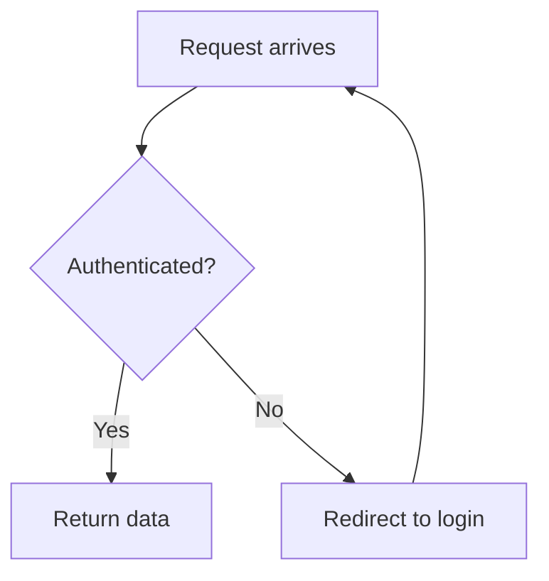
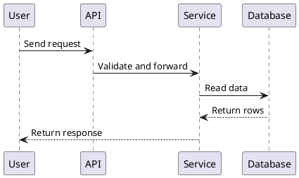
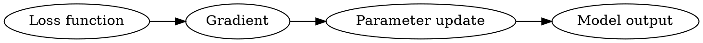

# 课件通用格式规范

本文件是跨语言课件格式的主真相源，适用于中文、英文和双语课程。

它只规定课程文件能使用什么结构、图表、图片、代码示例和可保存练习块；不规定某种语言的表达风格。中文表达看 `chinese-tutorial-guide.md`，英文表达看 `english-tutorial-guide.md`。播放器启动、会话文件和运行时写入规则看 `learning-viewer.md`。

## 基本原则

- 课程文件面向学习者，不写内部设计说明、生成理由、字段解释或工具选型。
- 每个模块围绕一个主目标展开；模块根目录的 `content.md` 写章节前言，
  小节正文写入 `{module}/{section}/content.md`。
- 一个小节只讲一个主要概念、主问题或紧密相关的操作任务。关联性不强的
  知识点必须拆成不同小节文件，不能为了减少文件数并入同一个 `content.md`。
- 小节独立成立的标准是：学习者读完后能解释一个概念、完成一个判断、跑通
  一个步骤、解决一个题型，或看懂一个材料片段。只是同属同一章、同一 PPT、
  同一 API 类目，不算紧密相关。
- 小节太长就拆分。只有两个小点共享同一个问题入口、同一个例子、同一套
  判断标准，并且合并后仍能完整讲透时，才允许合并；不要因为单个小节偏短就
  把弱关联内容硬塞进去。
- 解释、示例、图表、练习要互相服务，不为了凑数量加入装饰内容。
- 课程生成优先做衔接、过渡和通俗化表达：把资料里的术语、PPT 要点、论文
  段落或官方文档改写成可学习的讲义。除非目标、时间、考纲或用户材料明确
  要求取舍，禁止把应讲内容浓缩成提纲式摘要。
- 课程正文不要暴露生成过程、验证过程或本机环境限制。不要写“验证状态”“本机未安装”“未执行验证”“代码未运行”这类面向 agent 的说明。
- 学习者需要亲自运行的代码，才给出必要环境、安装命令、运行命令和预期输出；只用于解释概念的短代码，可以只给代码和结果解读。
- 如果 agent 没有实际运行代码，只能在对话交付说明里讲清楚，不能写进学生课件正文；课件里也不能声称“已验证通过”。
- 引用外部资料时，保留来源链接或文件路径。不要大段复制资料原文。
- 对具体概念、API、定理、工具命令有帮助的官方或权威资料，可以在相关小节旁边放一条短链接，并说明它适合查什么；课程级来源放在 `README.md` 或 `syllabus.md`，不要默认另建资源文件。
- 默认课程产物必须被学习流程消费。不要为了“资料完整”生成本地播放器和 Phase 3 不读取的 `flashcards.csv`、`glossary.md`、`practice.md`、`interview-qa.md`、`exam-practice.md` 或 `resources.md`。

## Markdown 与媒体

课程文件默认使用 Markdown。播放器支持的精确语法以 `learning-viewer.md` 为准。

新课程推荐结构：

```text
{course-slug}/
├── README.md
├── syllabus.md
├── 01-{module}/
│   ├── content.md
│   ├── 01-{section}/
│   │   ├── content.md
│   │   └── images/
│   └── 02-{section}/
│       └── content.md
└── 02-{module}/
    └── content.md
```

章节前言 `content.md` 不写跳转到小节的 Markdown 超链接；播放器用目录树打开
小节，章节前言只写纯文本小节名和每节解决的问题。兼容旧课程：如果模块目录
只有 `content.md`，播放器会直接把它当作整章内容。

| 内容 | 推荐写法 | 备注 |
|------|----------|------|
| 正文 | Markdown 标题、段落、列表、表格 | 标题语言跟随课程语言 |
| 本地图片 | `` | 路径相对当前 `content.md` |
| 外部图片 | `` | 图片下方写来源 |
| 代码 | fenced code block | 标明语言；学习者需要运行时给命令和预期输出 |
| 权威链接 | 简短引用块或行内链接 | 放在相关知识点附近，说明用途 |
| 流程/时序/状态/ER 图 | `mermaid` | 默认文本图格式 |
| UML 图 | `plantuml` 或 `puml` | 类图、组件图、部署图、时序图 |
| 依赖图/知识 DAG | `graphviz` 或 `dot` | 知识依赖、图算法、系统依赖 |
| 架构关系图 | `d2` | 服务关系、模块关系 |
| 数据图 | `vega-lite` | 小型统计图、趋势、分布 |
| 可保存练习 | `study-choice` / `study-truefalse` / `study-input` | 按题型渲染；提交后自动展开参考答案或解析 |

## 图表选择

当 Phase 2 的质量门要求图表，或内容涉及流程、架构、层级、对比、依赖关系时，按以下优先级选择：

1. **现成优质图**：优先复用调研阶段收集到的官方文档、教材、论文或优质教程图。要求清晰、直接服务当前教学点，并注明来源。
2. **平台生图**：只有当文本图难以表达时使用，例如复杂 UI 示意、物理/生物结构、数据结构可视化、节点超过 15 个的复杂流程。
3. **可渲染文本图**：默认用 Mermaid；PlantUML、Graphviz、D2、Vega-Lite 只在明显更合适时使用。
4. **表格或 ASCII 结构**：当图表不会比表格更清楚时使用。

图表规则：

- 一张图只说明一个要点。复杂系统拆成多张图。
- 图中标签使用课程语言；变量名、函数名、协议名保留原文。
- 每张图后写一行说明，解释这张图帮学习者看懂什么。
- 不要为了满足视觉要求加入装饰图。
- 文本图表代码块即可，不需要额外导出 PNG，除非目标平台不能渲染或图过于复杂。

## 图表示例

Mermaid 流程图：

````markdown

````

PlantUML 时序图：

````markdown

````

Graphviz 依赖图：

````markdown

````

Vega-Lite 小图表：

````markdown
```vega-lite
{
  "$schema": "https://vega.github.io/schema/vega-lite/v5.json",
  "data": {"values": [{"step": "Day 1", "score": 40}, {"step": "Day 2", "score": 65}]},
  "mark": "line",
  "encoding": {
    "x": {"field": "step", "type": "nominal"},
    "y": {"field": "score", "type": "quantitative"}
  }
}
```
````

## 可保存练习块

先写学习者能看懂的题目，再按需补一个 `study-*` fenced block。代码块是给本地课程播放器读取的，不要在正文里解释字段实现。

凡是希望学习者先作答、再看答案或解析的题，都应写成题型块。播放器先保存学习者作答，提交后自动展开参考内容。普通 Markdown 题只适合无需保存、无需延迟显示答案的开放讨论。

新课程只使用三类题型：

1. `study-choice`：单选或多选。用来检查概念辨析、方案选择、面试追问、考试选择题。
2. `study-truefalse`：判断题。用来拆误解、检查边界条件和易混点。
3. `study-input`：开放作答题。短答、解释题、场景分析、面试回答、考试主观题都用它；通过参数控制输入长度和提示。

不要把 `checkpoint` 做成一种题型。模块末尾如果需要综合检查，就连续放 2-4 道普通题型，并用 `mastery_tags` 标记它们覆盖 recall、apply、explain、interview 或 exam。会话结束后由教学 agent 根据这些真实作答判断掌握度。

最小写法：

````markdown
### Practice: {learner-facing title}

{One sentence telling the learner what to do.}

```study-input
id: 01-topic-short
question: {question}
answer: {reference answer or reasoning}
mastery_tags: [recall]
```
````

完整示例：

````markdown
```study-choice
id: 01-loss-choice
question: Which symptom most directly suggests overfitting?
options:
  - value: A
    text: Training loss falls, validation loss rises.
  - value: B
    text: Both training and validation loss fall.
  - value: C
    text: The model has fewer parameters than before.
answer: A
explanation: The model is fitting the training set better while generalizing worse.
mastery_tags: [apply]
```

```study-truefalse
id: 01-gradient-truefalse
question: A gradient only tells us whether the current answer is correct.
answer: false
explanation: A gradient gives a local direction for changing parameters; correctness is judged through the loss and task target.
mastery_tags: [misconception]
```

```study-input
id: 01-loss-input
question: Explain what a loss function contributes during training.
mode: multi
min_words: 30
hints:
  - Name what the loss compares.
  - Say how it becomes useful for optimization.
answer: >-
  It turns the gap between model output and target into a value that can be optimized.
  The optimizer uses changes in that value to decide how to update parameters.
mastery_tags: [recall, explain]
```
````

写法规则：

- `id` 在整门课内稳定唯一，只用小写字母、数字和连字符。
- `question`、`options`、`answer` 和 `explanation` 要像正常教材题，不要写成系统字段说明。
- `answer` 放参考答案；`explanation` 放解析、参考思路、评分点、面试回答要点或常见追问。
- `answer` 或 `explanation` 很长时，用 YAML 多行文本写法，例如 `explanation: >-` 后缩进多行正文。
- `study-choice.options` 可以写字符串列表，也可以写 `{value, text, note}` 对象；`answer` 为数组时表示多选。
- `study-input.mode` 可选 `single` 或 `multi`，默认 `multi`；`min_words` 用来提示答题长度，不是播放器判分规则。
- `hints` 可选，通常 1-3 条；不要把答案拆成提示泄露出去。
- `mastery_tags` 用来给教学 agent 判断证据类型，常用值包括 `recall`、`apply`、`analyze`、`explain`、`misconception`、`interview`、`exam`。
- 课程文件不记录正确、通过、XP、掌握度或自评分。
- 旧版 `study-recall`、`study-transfer`、`study-feynman`、`study-checkpoint` 只为历史课程兼容；新课程不要继续生成。
- 普通讨论题不需要 `study-*` block，直接写成 Markdown。

## 术语、资源和导出

术语、资源、题库和闪卡不是默认独立文件，而是学习流程里的内容。

- 术语首次出现时就地解释。术语多时，在当前模块末尾写短小的“术语速查”或 “Term check”。
- 官方文档、教材、论文、源码链接放在相关知识点旁边；课程级来源放在 Module 00 或 `syllabus.md`。
- 面试题、考试题和综合练习写成模块内的 `study-choice`、`study-truefalse` 或 `study-input`。
- 复习项写入 `concepts.json` 的时机在 Phase 3：学习者真实接触概念之后。不要从未学内容预生成闪卡。
- 只有用户明确要求，或已有确定工具会消费时，才生成导出文件，例如 Anki CSV、打印版术语表或资源附录。导出文件必须从 `README.md` 或相关模块链接过去，并说明用途。

## 质量自检

生成课程文件后，至少检查：

- 是否有明确学习目标、前置条件、主体解释、练习和小结；下一步只在有具体动作时保留。
- 是否按 Phase 2 要求加入必要图表或表格。
- 需要保存作答的练习是否使用了 `study-*` block。
- 需要学习者运行的代码是否有必要环境、命令和预期输出；是否把 agent 验证状态误写进了学生正文。
- 图片、图表、数据和观点是否有来源。
- 文件中是否混入内部实现说明、状态字段解释或 agent 自我评价。
- 是否生成了学习流程不消费的旁路文件；如果有，删除或改成模块内可交互内容。
