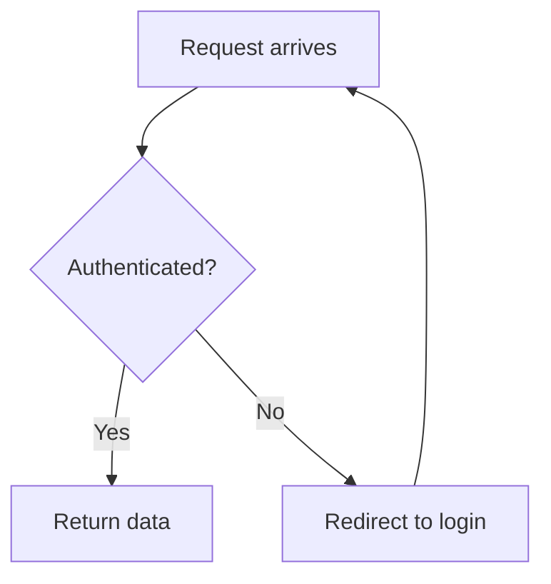
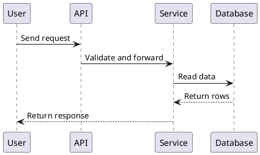
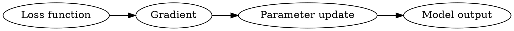

# 课件通用格式规范

本文件是跨语言课件格式的主真相源，适用于中文、英文和双语课程。

它只规定课程文件能使用什么结构、图表、图片、代码示例和可保存练习块；不规定某种语言的表达风格。中文表达看 `chinese-tutorial-guide.md`，英文表达看 `english-tutorial-guide.md`。播放器启动、会话文件和运行时写入规则看 `learning-viewer.md`。

## 基本原则

- 课程文件面向学习者，不写内部设计说明、生成理由、字段解释或工具选型。
- 每个模块围绕一个主目标展开；一个小节只讲一个主要概念。
- 解释、示例、图表、练习要互相服务，不为了凑数量加入装饰内容。
- 所有可运行代码都要给出运行环境、依赖、运行命令和预期输出；没有实际运行时必须标注“未执行验证”。
- 引用外部资料时，保留来源链接或文件路径。不要大段复制资料原文。
- 对具体概念、API、定理、工具命令有帮助的官方或权威资料，可以在相关小节旁边放一条短链接，并说明它适合查什么；课程级来源放在 `README.md` 或 `syllabus.md`，不要默认另建资源文件。
- 默认课程产物必须被学习流程消费。不要为了“资料完整”生成本地播放器和 Phase 3 不读取的 `flashcards.csv`、`glossary.md`、`practice.md`、`interview-qa.md`、`exam-practice.md` 或 `resources.md`。

## Markdown 与媒体

课程文件默认使用 Markdown。播放器支持的精确语法以 `learning-viewer.md` 为准。

| 内容 | 推荐写法 | 备注 |
|------|----------|------|
| 正文 | Markdown 标题、段落、列表、表格 | 标题语言跟随课程语言 |
| 本地图片 | `` | 路径相对当前 `content.md` |
| 外部图片 | `` | 图片下方写来源 |
| 代码 | fenced code block | 标明语言；可运行代码给命令和输出 |
| 权威链接 | 简短引用块或行内链接 | 放在相关知识点附近，说明用途 |
| 流程/时序/状态/ER 图 | `mermaid` | 默认文本图格式 |
| UML 图 | `plantuml` 或 `puml` | 类图、组件图、部署图、时序图 |
| 依赖图/知识 DAG | `graphviz` 或 `dot` | 知识依赖、图算法、系统依赖 |
| 架构关系图 | `d2` | 服务关系、模块关系 |
| 数据图 | `vega-lite` | 小型统计图、趋势、分布 |
| 可保存练习 | `study-recall` / `study-transfer` / `study-feynman` / `study-checkpoint` | 只保存原始作答；回忆题和迁移题提交后才显示参考内容 |

## 图表选择

当 Phase 2 的质量门要求图表，或内容涉及流程、架构、层级、对比、依赖关系时，按以下优先级选择：

1. **现成优质图**：优先复用调研阶段收集到的官方文档、教材、论文或优质教程图。要求清晰、直接服务当前教学点，并注明来源。
2. **平台生图**：只有当文本图难以表达时使用，例如复杂 UI 示意、物理/生物结构、数据结构可视化、节点超过 15 个的复杂流程。
3. **可渲染文本图**：默认用 Mermaid；PlantUML、Graphviz、D2、Vega-Lite 只在明显更合适时使用。
4. **表格或 ASCII 结构**：当图表不会比表格更清楚时使用。

图表规则：

- 一张图只说明一个要点。复杂系统拆成多张图。
- 图中标签使用课程语言；变量名、函数名、协议名保留原文。
- 每张图后写一行说明，解释这张图帮学习者看懂什么。
- 不要为了满足视觉要求加入装饰图。
- 文本图表代码块即可，不需要额外导出 PNG，除非目标平台不能渲染或图过于复杂。

## 图表示例

Mermaid 流程图：

````markdown

````

PlantUML 时序图：

````markdown

````

Graphviz 依赖图：

````markdown

````

Vega-Lite 小图表：

````markdown
```vega-lite
{
  "$schema": "https://vega.github.io/schema/vega-lite/v5.json",
  "data": {"values": [{"step": "Day 1", "score": 40}, {"step": "Day 2", "score": 65}]},
  "mark": "line",
  "encoding": {
    "x": {"field": "step", "type": "nominal"},
    "y": {"field": "score", "type": "quantitative"}
  }
}
```
````

## 可保存练习块

先写学习者能看懂的题目，再按需补一个 `study-*` fenced block。代码块是给本地课程播放器读取的，不要在正文里解释字段实现。

凡是希望学习者先作答、再看答案或解析的题，都应写成 `study-recall` 或 `study-transfer`。本地播放器会先保存学习者答案，再解锁 `answer`。普通 Markdown 题只适合无需保存、无需延迟显示答案的开放讨论。

优先级：

1. `study-recall`：刚讲完关键概念后使用，检查能否回忆。
2. `study-transfer`：核心模块优先使用，要求换场景应用。
3. `study-feynman`：要求学习者用自己的话解释概念。
4. `study-checkpoint`：模块末尾使用一次，引用前面的练习。

最小写法：

````markdown
### Practice: {learner-facing title}

{One sentence telling the learner what to do.}

```study-recall
id: 01-topic-recall-1
question: {question}
answer: {reference answer or reasoning}
```
````

完整示例：

````markdown
```study-recall
id: 01-loss-recall
question: What does a loss function do during training?
answer: It turns the gap between the model output and the target into a value that can be optimized.
```

```study-transfer
id: 01-loss-transfer
question: If validation loss rises while training loss falls, what would you suspect first?
hints:
  - Compare what the training set and validation set measure.
  - Think about whether the model is memorizing the training data.
answer: Suspect overfitting first, then check regularization, data size, training length, and model capacity.
```

```study-feynman
id: 01-gradient-feynman
concept: gradient descent
prompt: Explain in your own words why a gradient tells the model how to change its parameters.
key_points: loss function, slope, update direction, learning rate
```

```study-checkpoint
module: 01-training-basics
items:
  - type: recall
    ref: 01-loss-recall
  - type: transfer
    ref: 01-loss-transfer
  - type: feynman
    ref: 01-gradient-feynman
min_pass: 2
```
````

写法规则：

- `id` 在整门课内稳定唯一，只用小写字母、数字和连字符。
- `question` 和 `answer` 要像正常教材题，不要写成系统字段说明。
- `answer` 可以包含参考答案、参考思路、解析、评分点或面试回答要点；不要新增 `analysis`、`rubric` 等字段来承载播放器不会读取的内容。
- `answer` 很长时，用 YAML 多行文本写法，例如 `answer: >-` 后缩进多行正文。
- `study-transfer` 包含 1-3 条 `hints`。
- `study-feynman` 使用 `concept`，可选 `prompt` 和 `key_points`。
- `study-checkpoint` 引用前面出现过的 `study-*` block id，并设置 `min_pass`。
- 课程文件不记录正确、通过、XP、掌握度或自评分。
- 普通讨论题不需要 `study-*` block，直接写成 Markdown。

## 术语、资源和导出

术语、资源、题库和闪卡不是默认独立文件，而是学习流程里的内容。

- 术语首次出现时就地解释。术语多时，在当前模块末尾写短小的“术语速查”或 “Term check”。
- 官方文档、教材、论文、源码链接放在相关知识点旁边；课程级来源放在 Module 00 或 `syllabus.md`。
- 面试题、考试题和综合练习写成模块内的 `study-transfer` 或 `study-checkpoint`。
- 复习项写入 `concepts.json` 的时机在 Phase 3：学习者真实接触概念之后。不要从未学内容预生成闪卡。
- 只有用户明确要求，或已有确定工具会消费时，才生成导出文件，例如 Anki CSV、打印版术语表或资源附录。导出文件必须从 `README.md` 或相关模块链接过去，并说明用途。

## 质量自检

生成课程文件后，至少检查：

- 是否有明确学习目标、前置条件、主体解释、练习和小结；下一步只在有具体动作时保留。
- 是否按 Phase 2 要求加入必要图表或表格。
- 需要保存作答的练习是否使用了 `study-*` block。
- 代码是否有环境、命令、输出和验证状态。
- 图片、图表、数据和观点是否有来源。
- 文件中是否混入内部实现说明、状态字段解释或 agent 自我评价。
- 是否生成了学习流程不消费的旁路文件；如果有，删除或改成模块内可交互内容。
