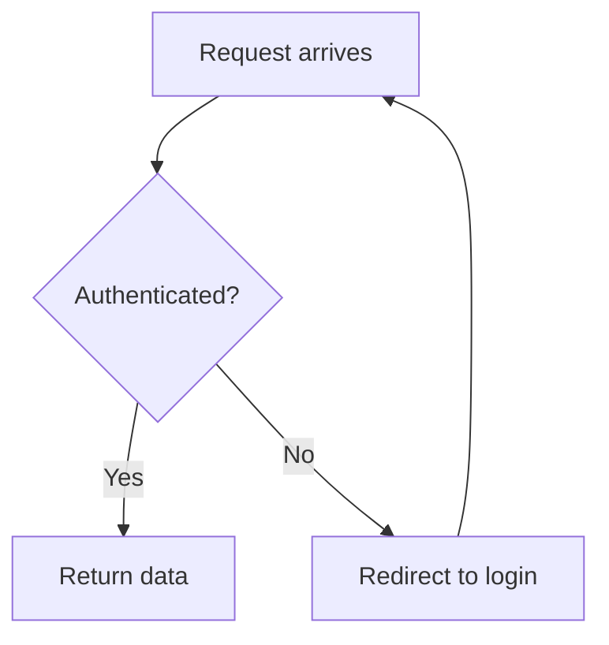
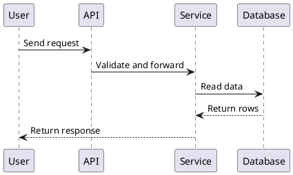
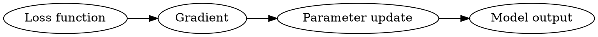

# 图表示例

本文件是 `courseware-format.md` 图表语法的完整示例，供生成课程时参考。

## Mermaid 流程图

````markdown

````

## PlantUML 时序图

````markdown

````

## Graphviz 依赖图

````markdown

````

## Vega-Lite 小图表

````markdown
```vega-lite
{
  "$schema": "https://vega.github.io/schema/vega-lite/v5.json",
  "data": {"values": [{"step": "Day 1", "score": 40}, {"step": "Day 2", "score": 65}]},
  "mark": "line",
  "encoding": {
    "x": {"field": "step", "type": "nominal"},
    "y": {"field": "score", "type": "quantitative"}
  }
}
```
````

## D2 架构关系图

````markdown
```d2
direction: right
api -> service: Send request
service -> database: Read data
database -> service: Return rows
service -> api: Return response
```
````
